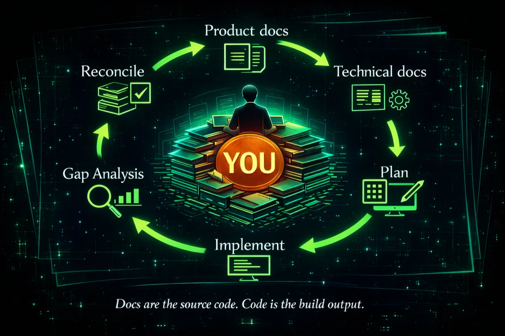

# fat-stack

<div align="center">
  
</div>

**Docs are the source code. Code is the build output.**

fat-stack is a set of Claude Code skills for a document-first workflow. If you're building faster than you can keep track of what you're building — if plans and decisions are scattered across prompts and nothing is actually the source of truth — fat-stack gives you one. Your docs. You spend your time making decisions in `docs/product/` and `docs/technical/`. Claude derives the rest.

## The loop

Every change follows the same six steps:

1. **Write product docs** (`/product` + `/product-author`) — what the feature does, in present tense, as if it already exists.
2. **Write technical docs** (`/eng` + `/technical-author`) — how it works; architecture, decisions, rationale.
3. **Plan** (`/improve-plan`) — derive a concrete implementation plan from the docs.
4. **Implement** (`/dev`) — Claude writes the code from the docs and patterns.
5. **Gap analysis** (`/deep-review`) — find where the code disagrees with the docs and patterns.
6. **Reconcile** (`/research-gaps`) — close each gap by updating code, updating docs, or accepting the drift intentionally.

Then back to step 1 for the next change.

## What this buys you

- **A single source of truth for what your app is supposed to be.** `docs/product/` is the contract. `docs/technical/` is the design. Nothing else has that job.
- **Docs that can lead the code.** Spend a day — or a week — writing docs before writing a line of code. Your docs describe the app as it should be; the code converges over time.
- **An agent that actually knows your project.** Because the docs are ground truth, Claude can answer questions about your system without guessing or grepping.
- **Drift you can see.** Gap analysis is a dedicated step. You don't hope the docs match reality — you check, and close the gap each iteration.
- **Time on decisions, not keystrokes.** You're deciding what the product does and how it should work. Claude is writing and reviewing. You approve the gaps.

## Strong opinions

fat-stack assumes you're committing to:

- **Claude Code as the environment.** The skills are Claude Code slash commands — no Claude Code, no fat-stack.
- **A `docs/` tree split into `product/` and `technical/`.** This is where the source of truth lives. `technical/` contains architecture docs and a `patterns/` subdirectory.
- **[fat-docs](https://github.com/rayepps/fat-docs) for semantic search over docs.** The docs tree is too large to grep effectively; semantic search is how the agent finds the right files. `fat-stack init` wires it in.
- **Patterns as a load-bearing discipline.** `docs/technical/patterns/` holds MUST/NEVER/SHOULD rules. `/dev` reads them before writing code; `/deep-review` checks implementation against them. Patterns are what makes "you don't need to read the code" actually true — without them, generated code drifts to mediocre-by-default. A mature codebase can easily accumulate 60+ pattern files and 400+ MUST/NEVER rules.
- **Docs as forward-looking truth.** No plans, migrations, or TODOs in `docs/product/` or `docs/technical/`.
- **Gap analysis isn't optional.** Skipping `/deep-review` is how docs and code drift apart.

If any of these aren't a fit, fat-stack probably isn't for you. Reasoning behind each: [`docs/methodology.md`](./docs/methodology.md).

## Try it

**New project (empty directory).** Tell Claude Code:

> I'm starting a new project. Run `npx fat-stack@latest init --agent` and walk me through the setup — this is a greenfield project.

Or from a terminal:

```bash
mkdir my-project && cd my-project
npx fat-stack@latest init
```

**Existing project.** Tell Claude Code:

> Run `npx fat-stack@latest init --agent` and walk me through the setup. This is an existing codebase.

Or from a terminal:

```bash
cd my-project
npx fat-stack@latest init
```

Both modes auto-detect greenfield vs. existing from the directory contents. Override with `--project-mode greenfield|existing` if detection is wrong. For a full reference of every option, see [`docs/init-config.md`](./docs/init-config.md).

## Deeper reading

The loop is the mechanism. The full methodology — what should and shouldn't live in `docs/`, how to run a doc-only iteration, how code converges to docs over time, and why you usually don't need to read it — is in [`docs/methodology.md`](./docs/methodology.md).

## Skills

| Skill | Role |
|---|---|
| `/fresh-start` | Produce the three foundation docs (product overview, technical stack, coding patterns). Run first on a greenfield project — or on an existing codebase to generate docs from what's there. |
| `/fat-help` | Explain the methodology and recommend the next step based on where you are. |
| `/product-author` | Write or update product documentation for a specific feature or topic. |
| `/technical-author` | Write or update technical documentation for a subsystem or design. |
| `/pattern-author` | Write or update a pattern doc — a rule `/dev` and `/deep-review` enforce. |
| `/dev` | Implement from the docs, following the project's coding patterns. |
| `/deep-review` | Multi-pass review of recent changes. The final pass is a gap analysis between docs and implementation. Uses Codex in parallel if installed. |
| `/research-gaps` | Turn gaps between documentation and implementation into reviewable follow-ups. |
| `/research-open-questions` | Surface every unresolved question blocking current work. |
| `/improve-plan` | Refine the current plan with three refinement passes. |
| `/check-launch-ready` | Determine whether the implementation is ready for end-to-end user testing. |
| `/ensure-docs-consistent` | Reconcile documentation consistency across the whole docs directory. |
| `/product` | Product advisor mode. |
| `/eng` | Founding-engineer advisor mode. |
| `/study` | Orient on the current project using its documentation. |

Skills install as flat slash commands by default (`/dev`, not `/fat-stack:dev`). `/fat-help` is the one exception — always prefixed to avoid colliding with Claude Code's built-in `/help`. Opt into prefixing the rest via `--skill-prefix=yes`.

By default skills install to `~/.claude/commands/` (user scope) so they're available in every project on your machine. Pass `--install-scope=project` to install to `./.claude/commands/` instead — useful for committing the skills to a repo and sharing them with a team. See [`docs/init-config.md`](./docs/init-config.md#--install-scope).

## Dependencies

fat-stack's document-first loop depends on the project having a `docs/` tree split into `docs/product/` and `docs/technical/`, plus a searchable index. That's what **[fat-docs](https://github.com/rayepps/fat-docs)** provides. The `fat-stack init` CLI runs `fat-docs init` for you.

Codex MCP is optional. If installed, `/deep-review` uses it as a second-opinion reviewer in parallel with Claude.

## Uninstall

```bash
npx fat-stack@latest uninstall
```

Removes the skills fat-stack installed. Project-level files (`CLAUDE.md`, `.mcp.json`, `docs/`) are left alone.

## License

MIT.
